<h1 align="center">Interakcija 캜ovjek ra캜unar</h1>

<h3 align="center">Sistem za pra캖enje nastavnih aktivnosti</h3>

## Svrha dokumenta

Svrha ovog dokumenta je da pru쬴 detaljan pregled glavnih funkcionalnosti i da korisnicima omogu캖i uvid u kori코캖enje aplikacije. U dokumentu su prikazane sve osnovne funkcionalnosti kroz slike i tekst.

## O aplikaciji

Aplikacija ima zadatak da pokrije osnovne potrebe studenata i profesora u vezi njihove interkacije i neophodne razmjene podataka. Omogu캖ava jednostavan uvid studentima u obaveze, postignute rezultate i dostignu캖a, a profesorima lako zadavanje svih neophodnih zadataka i indirektne komunikacije sa studentima.

## Korisni캜ki nalozi

 Aplikacija podrzava rad sa tri tipa korisnika:
 1. administrator
 2. student
 3. profesor

## Funkcionalnosti

| **Tip korisnika**       | **Funkcionalnosti**                                                                                                                                                            |
|--------------------------|-------------------------------------------------------------------------------------------------------------------------------------------------------------------------------|
| **Superadministrator**   |  Dodavanje i brisanje profesora: Superadministrator mo쬰 dodavati nove profesore sa osnovnim podacima i dodeljivati im predmete.                                              |
|                          |  Dodavanje i brisanje studenata: Superadministrator mo쬰 dodavati nove studente, unositi njihove osnovne podatke.                              |
|                          |  Kreiranje i a쬿riranje predmeta: Superadministrator mo쬰 kreirati nove predmete sa osnovnim informacijama i dodjeljivati ih profesorima.                                    |
|                          |  Dodjela prava pristupa: Superadministrator dodjeljuje profesorima administratorska prava za predmete koje predaju, 캜ime ograni캜ava njihov pristup na relevantne podatke.    |
|  **Profesor**            |  Dodavanje doma캖ih zadataka i ispita: Profesor mo쬰 dodati doma캖e zadatke i ispite za svoje predmete, uklju캜uju캖i rokove i maksimalne bodove.                                |
|                          |  Vo캠enje evidencije o prisustvu: Profesor mo쬰 uneti prisustvo za svakog studenta na predmetu, uklju캜uju캖i datume.                                       |
|                          |  Unos i pregled ocjena: Profesor mo쬰 dodavati ocjene za ispite za studente na svojim predmetima. Mo쬰 da pregleda sve ocjene studenata na predmetima koje predaje za studente koje slu코aju predmete.                                                                   |
|                          |  Pregled rezultata studenata: Profesor mo쬰 pregledati ukupne rezultate po studentu za svoje predmete, uklju캜uju캖i prisustvo, bodove iz zadataka i ocjene sa ispita.        |
| **Student**              |  Pregled prisustva: Student mo쬰 pregledati svoje prisustvo po predmetu, uz detalje o svakom 캜asu.                                                                           |
|                          |  Pregled doma캖ih zadataka i ispita: Student mo쬰 pregledati doma캖e zadatke za svaki predmet, uklju캜uju캖i rokove.                      |
|                          |  Pregled ukupnog uspjeha: Student mo쬰 vidjeti svoj ukupan uspjeh po predmetu kroz zbir bodova i ocjena koje je dobio.                                                       |
| **Svi korisnici**        |  Internacionalizacija: Sistem omogu캖ava korisnicima da biraju izme캠u vi코e jezika.                                                                                           |
|                          |  Pode코avanje tema: Korisnici mogu birati izme캠u svetle i tamne teme, koja se automatski 캜uva za svakog korisnika.                                                           |
|                          |                                                                  |

## Korisni캜ko upustvo

### Prijava u aplikaciju

Za pristupanje aplikaciji  neophodno je da se korisnici prvo autentifikuju na sam sistem
tj. da se prijave. Za prijavu korisnici koriste odgovaraju캖e kredencijale u obliku korisni캜kog
imena i lozinke. Pristupne kredencijale dobijaju od administratora/menad쬰ra, koji je zadu쬰n
za kreiranje naloga. Korisnici moraju da pamte svoje kredencijale.

Prilikom otvaranja aplikacije korisniku se pojavljuje po캜etni ekran u kojem unosi svoje korisni캜ko ime i svoju lozinku. Kada korisnik unese kredencijale, pritisne dugme Prijava/LogIn. S obzirom da postoje tri tipa korisni캜kih naloga (student, profesor, administrator), 
prvo se provjerava da li su korisni캜ko ime i lozinka validni. Ako su validni, otvara se odgovaraju캖i prozor u zavisnosti od tipa korisni캜kog naloga. Prozori 캖e korisnicima omogu캖iti neophodne interakcije.

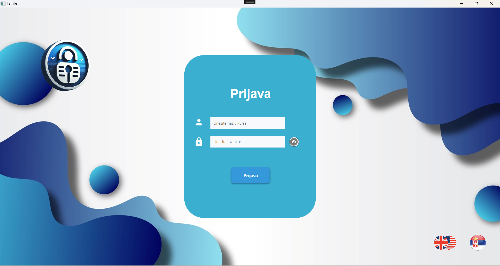

Ako su korisni캜ko ime ili lozinka pogre코ni, ispisa캖e se povratni prozor koji 캖e obavijestiti korisnika da postoji gre코ka pri unosu korisni캜kog imena ili lozinke.

### Izbor jezika aplikacije

Aplikacija omogu캖ava korisnicima da na po캜etnom ekranu odaberu 쬰ljeni jezik izme캠u **srpskog** i **engleskog**, 캜ime se prilago캠ava korisni캜ko iskustvo.

#### Postupak odabira jezika:

1. **Prikaz opcija jezika:**
   - Na po캜etnom ekranu se nalaze dva dugmeta za izbor jezika, prikazana zastavicama:
     - **游游 Srpska zastava** za srpski jezik.
     - **游섫릖/游쥟릖 Britanska/Ameri캜ka zastava** za engleski jezik.

2. **Radnje korisnika:**
   - **Klikom na dugme sa srpskom zastavom (游游):**
     - Aplikacija prelazi na **srpski jezik**.
     - Sve komande, tekstovi i opcije u aplikaciji prikazuju se na srpskom jeziku.
   - **Klikom na dugme sa britanskom ili ameri캜kom zastavom (游섫릖/游쥟릖):**
     - Aplikacija prelazi na **engleski jezik**.
     - Sve komande, tekstovi i opcije u aplikaciji prikazuju se na engleskom jeziku.

#### Pozicija dugmadi:

Dugmad za izbor jezika nalaze se u **donjem desnom uglu po캜etnog ekrana**, omogu캖avaju캖i jednostavan i intuitivan odabir jezika.

 

## Promjena teme

Kada se korisnik uspje코no prijavi, otvori캖e mu se odgovaraju캖i prozor, u zavisnosti tipa korisnika. Prijavljeni korisnik 캖e sa lijeve strane imati MenuBar.
Svaki korisnik moze da promijeni temu, tako 코to se u MenuBar, sa lijeve strane, desnim klikom pritisne na ikonicu za promijenu teme.

Otvori 캖e se meni sa temama, tako da korisnik mo쬰 da izabere izme캠u plave, crvene ili zelene teme. Kod svih korisnika kada izaberu temu pamti캖e se izbor tema, tako da prilikom sljede캖e prijave aplikacija se pokre캖e sa posljednjim sa캜uvanim  izborom teme.
Teme se razlikuju po pozadini, fontu slova, boji slova, dizajnu dugmadi.
Primjer izgleda dvije teme za interfejs profesora (crvene i zelene), dok 캖e se tre캖a tema (plava) koristiti u ovom dokumentu.

  
  

## Funkcionalnosti administratora

Administrator aplikacije ima mogu캖nost upravljanja entitetima ( dodavanje, brisanje, a쬿riranje studenata, profesora, predmeta) i dodjele zadu쬰nja profesorima na predmetima, kao i pristup raznim opcijama putem interfejsa.

Kada se administrator unosom kredencijala prijavi, otvara se administratorski prozor.

### Glavne funkcionalnosti:

1. **Dodavanje, a쬿riranje i brisanje entiteta:**
   - Administrator mo쬰 kreirati nove entitete (npr. studente, profesore, predmete).
   - Mo쬰 a쬿rirati postoje캖e podatke o entitetima.
   - Mo쬰 obrisati entitete iz sistema.
   - Mo쬰 da profesore zadu쬿je/razdu쬿je na predmetima

2. **MenuBar sa dodatnim opcijama:**
   - **Cancel dugme:** Omogu캖ava 캜i코캖enje svih unesenih podataka u aplikaciji.
   - **Delete ikonica:** Koristi se za brisanje studenata iz sistema.
   - **Ikonica za promjenu pozadine:** Omogu캖ava promjenu vizuelnog izgleda aplikacije.
   - **Logout ikonica:** Koristi se za odjavu administratora iz aplikacije.

- MenuBar se nalazi na **lijevoj strani aplikacije**, omogu캖avaju캖i brz i intuitivan pristup opcijama.
- Sve akcije su jasno ozna캜ene i vizualno predstavljene putem ikonica, 캜ime se olak코ava rad administratora.

### Dodavanje studenata, profesora, predmeta

 Administrator ukoliko 쬰li da doda ili studenta ili profesora ili predmet, mora da izabere karticu **"Dodaj" **. Kada izabere karticu dodaj, mo쬰 da bira koji entitet 쬰li da doda. Ukoliko 쬰li da doda profesora, treba da izabere **Profesor**, studenta **Student**, predmet **Predmet**. 

  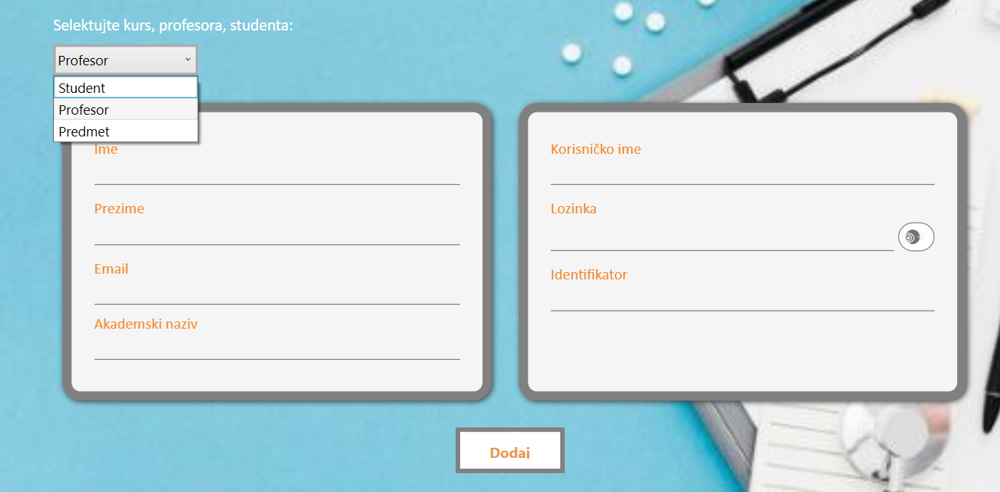

U zavisnosti od izabranog entiteta, otvara se forma za unos podataka. Ako administrator selektuje **Profesor**, dobija formu za kreiranje naloga za profesora. Pretpostavlja se da administrator zna osnovne podatke profesora, pa ih unosi, ali  kreira i kredencijale koje 캖e profesor kasnije koristiti za logovanje.

  

 Prilikom unosa, ukoliko 쬰li da prekine unos i izbri코e sve unijeti podatke u polja mo쬰 da pritisne dugme za **"Cancel"**, te na taj na캜in da o캜ite polja.
 Na isti na캜in, koriste캖i **"Cancel**, mo쬰 da o캜isti i polja za **Studenta** i **Predmet**.

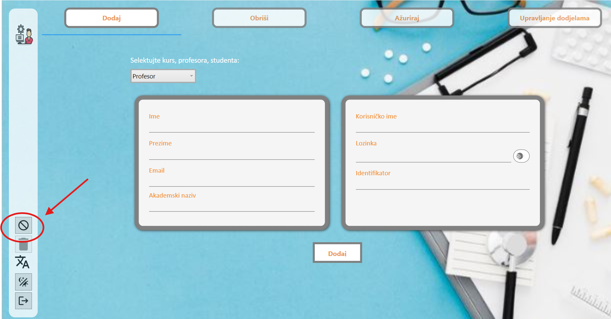

Dodavanje **Studenta** i **Predmeta** 캖e imati svoje forme.

  
  

Sva polja prilikom dodavanja moraju biti popunjena, u suprotnom 캖e korisnik dobiti povratnu informaciju da postoje prazna polja.

### Brisanje studenata, profesora, predmeta

Ukoliko administrator 쬰li da obri코e entitet kao 코to su student, profesor ili predmet, potrebno je da odabere karticu "Obri코i". U okviru ove kartice nalazi se ComBox u kojem administrator mo쬰 izabrati tip entiteta koji 쬰li da obri코e (Predmet, Student, Profesor).

Nakon 코to administrator izabere odgovaraju캖i entitet, na ekranu 캖e se prikazati svi entiteti tog tipa. Administrator zatim mo쬰 selektovati specifi캜an entitet koji 쬰li da obri코e, a potom u MenuBar-u pritisnuti ikonu za "Brisanje".

 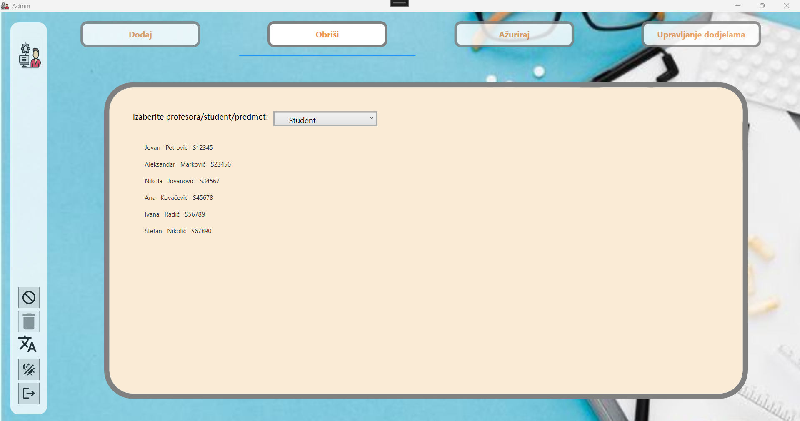

Na primer, ako administrator izabere "Profesor", prikaza캖e se lista svih profesora. Administrator mo쬰 da selektuje profesora kojeg 쬰li da obri코e, nakon 캜ega treba da pritisne ikonu "Delete". Nakon toga 캖e isko캜iti Confirm prozor, ako korisnik 쬰li zaista da obri코e treba da pritisne dugme za potvrdu.

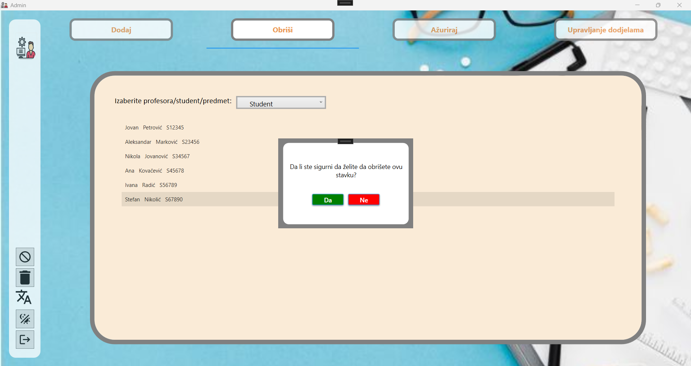

### A쬿riranje

Ukoliko administrator 쬰li da a쬿rira neki entitet (studenta, profesora, predmet), mora da izabere tab za **"A쬿riranje"**.
Nakon toga, prikazuje se okru쬰nje za a쬿riranje.

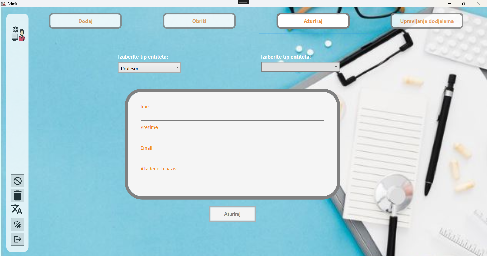

Postoje dva ComBox. U prvom ComBox-u  se bira koji entitet 쬰li da a쬿rira.

 Nakon 코to izabere entitet koji 쬰li da a쬿rira, prikazuje se forma sa poljima za a쬿riranje.
Ovo je forma za a쬿riranja Profesora:

Ovo je forma za a쬿riranje Studenta:

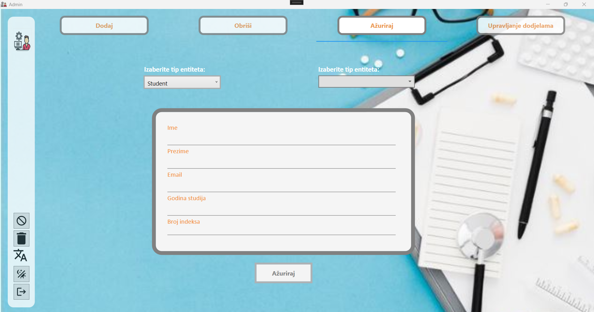

Ovo je forma za a쬿riranje Predmeta:

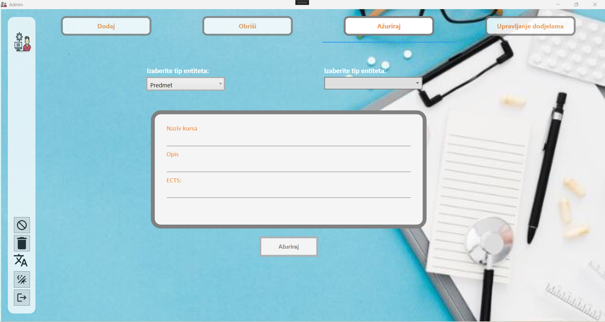

 Administrator treba da izabere konkretan entitet koji 쬰li da a쬿rira. Nakon 코to selektuje entitet kojeg 쬰li da a쬿rira, popunjava se forma za a쬿riranje podacima 
izabranog entiteta.

U formi se podaci mogu izmijeniti. Svi podaci se mogu izmijeniti. Kada se pritisne na dugme "A쬿riraj", podaci se a쬿riraju.

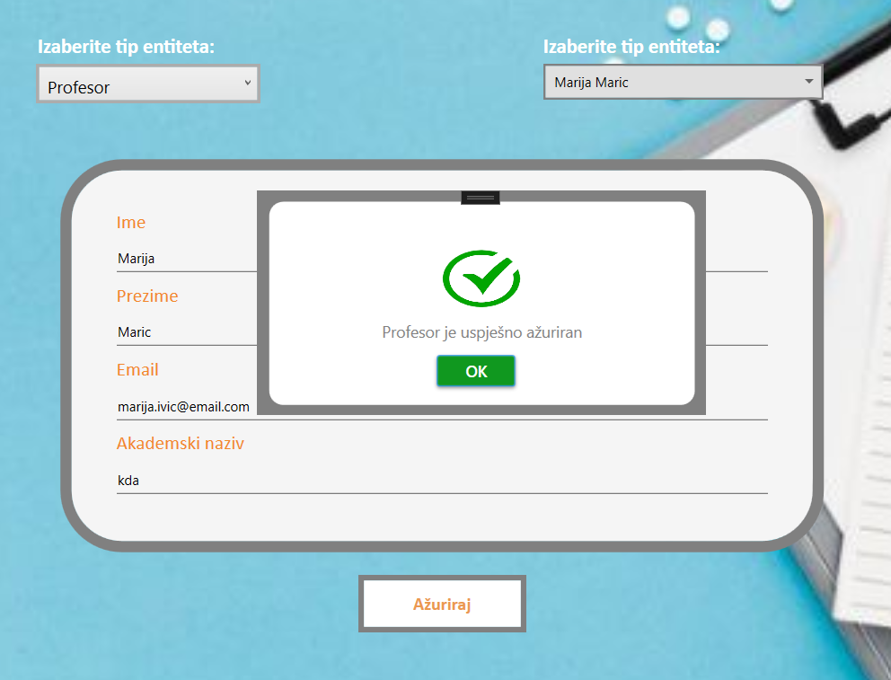

### Upravljanje Dodjelama

Funkcionalnost za **Upravljanje dodjelama** uklju캜uje dvije kartice: **"Zadu쬴 profesora"** i **"Razdu쬴 profesora"**.

#### Zadu쬴 profesora

Kartica **"Zadu쬴 profesora"** omogu캖ava administratoru da dodijeli predmet profesoru. Ova kartica sadr쬴 dva **ComBox**-a:
1. **Prvi ComBox** omogu캖ava odabir profesora kojem 캖e biti dodijeljen predmet.
2. **Drugi ComBox** omogu캖ava odabir predmeta koji 캖e biti dodijeljen izabranom profesoru.

Nakon 코to administrator odabere odgovaraju캖e opcije, klikom na dugme **"Zadu쬴"**, profesor se zadu쬿je za predmet. Ukoliko admin nije selektovao profesora i predmet koji mu se dodijeljuje, onda ne캖e mo캖i kliknuti da dugme "Zadu쬴".

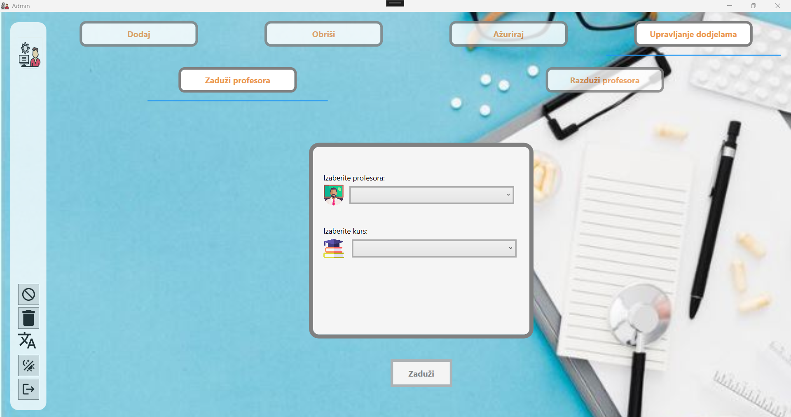

#### Razdu쬴

Kartica **"Razdu쬴"** omogu캖ava uklanjanje zadu쬰nja profesora za odre캠eni predmet. Proces uklju캜uje dva **ComBox**-a:

1. **Prvi ComBox** omogu캖ava odabir profesora koji se razdu쬿je sa predmeta.
2. **Drugi ComBox** omogu캖ava odabir predmeta sa kojeg se profesor razdu쬿je.

Nakon 코to su opcije izabrane, klikom na dugme **"Razdu쬴"**, profesor se razdu쬿je sa predmeta. To zna캜i da profesor vi코e ne캖e imati pristup funkcionalnostima vezanim za predmet, kao 코to su:

- Pregled studentata koji slu코aju predmet
- Dodavanje prisustva
- Dodavanje doma캖ih zadataka
- Unos ocjena

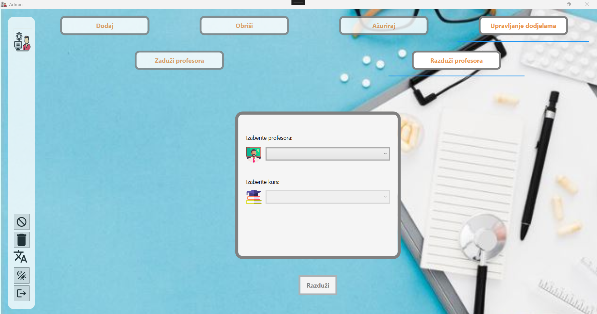
Samo profesor koji je zadu쬰n za predmet ima mogu캖nost pristupa ovim funkcijama.

### Opcija  Logout

Na samom dnu MenuBar-a je ikonica za **LogOut**. Kada korisnik dvoklikne na tu ikonicu odjavi캖e se se.

## Funkcionalnosti profesora

Kada se profesor uspje코no prijavi, otvara mu se prozor, tako da u vrhu postoje 캜etiri kartice:
1. **Predmeti**
2. **Doma캖i i Ispiti**
3. **Prisustvo**
4. **Ocjene**

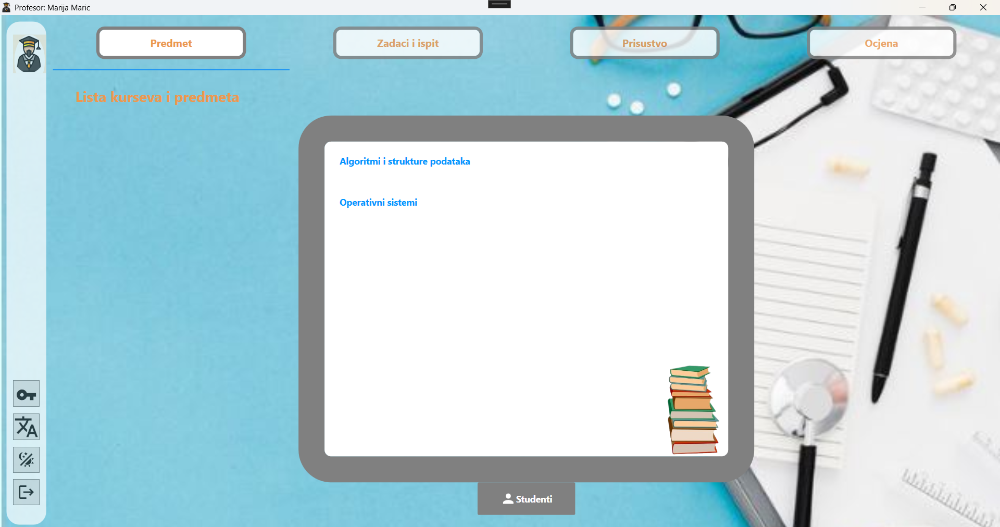

### Predmeti

U tabu **"Predmeti"** prikazani su predmeti koje profesor predaje. Kada selektuje neki predmet i dugme "Student",prikazuju  se studenti koji slu코aju predmet.

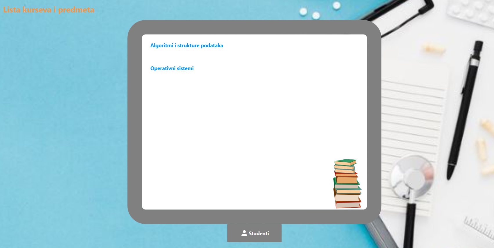

Studenti koji slu코aju predmet se prikazuju u posebnom prozoru.

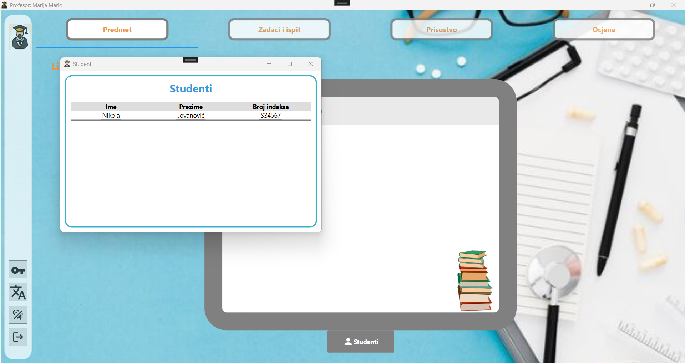

### Doma캖i zadaci

Profesor u tabu **Doma캖i zadaci** ima dva podtaba, jedan za dodavanje novog doma캖eg zadatka, a drugi za pregled svih doma캖ih zadataka.

#### Dodavanje doma캖eg zadatka

Profesor popunjava sva neophodna polja za doma캖i zadatak. Sva polja moraju da budu popunjena. Sva polja podr쬬vaju stringove, osim polja **Maksimalan broj bodova**, koji podr쬬va cjelobrojne vrijednosti.
Ukoliko sva polja nisu popunjena, korisnik 캖e dobiti povratnu informaciju.

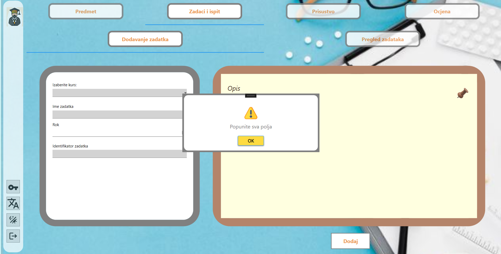

Profesor mo쬰 da doda doma캖i zadatak samo predmetima koje predaje. Isto tako, samo studenti koji slu코aju predmete mogu da pregledaju doma캖e zadatke. 
Kada se ** popune sva polja **, profesor pritiskom na dugme **"Dodaj"** pamti doma캖i zadatak. 

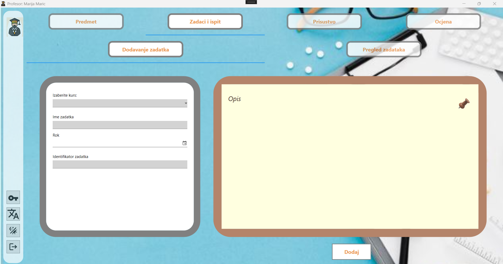

#### Pregled zadataka

U ovom tabu profesor mo쬰 da pregleda sve doma캖e zadatke, iz svih predmeta koje predaje. Mo쬰 da pregleda osnove informacije o svakom doma캖em zadatku.

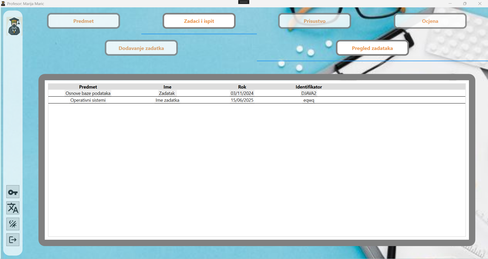

Kada klikne na konkretan zadatak otvara se posebna forma za detaljan prikaz informacija o zadatku, on mo쬰 da a쬿rira ta polja.

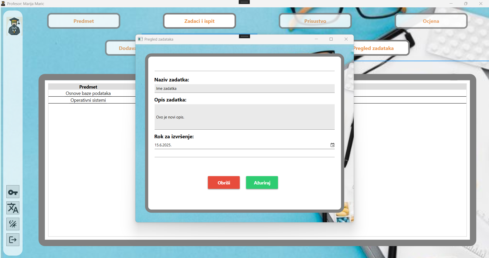

### Prisustvo

Profesor mo쬰 da vodi evidenciju o prisustvu studenata koji slu코aju njegov predmet. U tabu **Prisustvo**, postoji dva podtaba. Prvi podtab **Unos prisustva** omogu캖ava da se evidentira prisustvo, dok drugi tab 
**Pregled prisustva** omogu캖ava da se pregledaju prisustva.

#### Evidencija Prisustva

Evidencija prisustva obavlja se kroz slede캖e korake:

1. **Odabir predmeta**:  
   U lijevom **ComBox**-u nazvanom **Predmeti**, profesor odabire predmet za koji 쬰li da evidentira prisustvo.  
   Ovaj **ComBox** je automatski popunjen predmetima koje predaje profesor.  
   Nakon izbora predmeta, u tabeli 캖e se prikazati svi studenti koji poha캠aju odabrani predmet.

2. **Odabir datuma**:  
   U desnom **ComBox**-u nazvanom **Datum**, profesor bira datum za koji 쬰li da evidentira prisustvo.

3. **Evidentiranje prisustva**:  
   Tabela sadr쬴 kolonu pod nazivom **Prisustvo**, u kojoj se nalaze **Checkbox** polja za svaki red (studenta).  
   Profesor mo쬰 ozna캜iti prisustvo za svakog studenta pojedina캜no klikom na odgovaraju캖i **Checkbox**.

4. **캛uvanje evidencije**:  
   Nakon 코to je prisustvo svih studenata evidentirano, profesor pritisne dugme **"Sa캜uvaj"**, 캜ime se podaci o prisustvu memori코u.

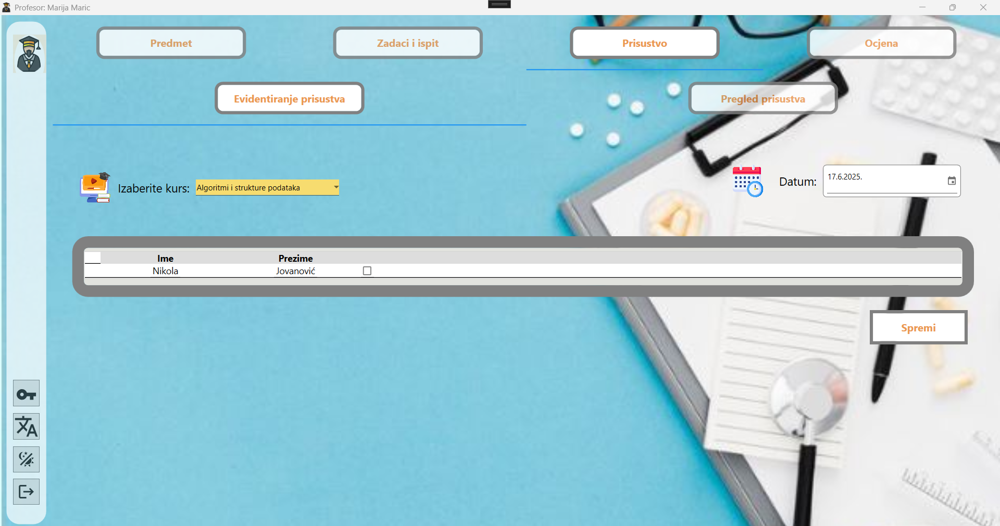

### Napomena:
- Lista predmeta i studenata dinami캜ki se generi코e na osnovu trenutnih podataka o zadu쬰njima profesora i upisima studenata.
- Evidencija se trajno 캜uva kako bi se omogu캖io uvid i dalja obrada podataka.

### Pregled Prisustva

Funkcionalnost **Pregleda prisustva** omogu캖ava profesorima ili administratorima da prate informacije o prisustvu studenata na odabranim predmetima. Proces pregleda prisustva se odvija na sljede캖i na캜in:

1. **Izbor studenta**  
   - U lijevom **ComBox-u** pod nazivom **"Student"**, potrebno je odabrati studenta za kojeg se 쬰li pregledati prisustvo.  
   
2. **Izbor predmeta**  
   - U desnom **ComBox-u** pod nazivom **"Predmeti"**, bira se predmet na kojem se tra쬴 prisustvo odabranog studenta.  

3. **Prikaz informacija o prisustvu**  
   - Nakon selekcije studenta i predmeta, tabela ispod se popunjava informacijama o prisustvu studenta za taj predmet.  
   - Ukoliko za odabranog studenta na selektovanom predmetu ne postoji evidentirano prisustvo, prikazuje se obave코tenje: **"Nema evidentiranog prisustva za izabranog studenta na selektovanom predmetu."**

Ova funkcionalnost pru쬬 brz i jasan uvid u evidenciju prisustva studenata na odabranim predmetima.

### Ocjene

Profesori imaju mogu캖nost  unos ocjena i pregleda ocjena studenata na predmetima na kojima je zadu쬰n.

#### Unos ocjena

Funkcionalnost unosa ocjena dostupna je u tabu **"Ocjene"** i realizuje se na slede캖i na캜in:

1. **Izbor predmeta**  
   - Profesor bira predmet na kojem je organizovan ispit. Mogu캖e je izabrati samo predmete na kojima profesor ima zadu쬰nje.

2. **Izbor datuma ispita**  
   - Nakon izbora predmeta, bira se datum odr쬬vanja ispita.

3. **Izbor studenta**  
   - Profesor odabire studenta kojem unosi ocjenu. Prikazuju se samo studenti koji slu코aju odabrani predmet.

4. **Unos bodova i ocjene**  
   - Profesor unosi broj bodova i ocjenu.  
   - **Napomena**: Ocjena mora biti cjelobrojna vrijednost. Ukoliko se poku코a unositi tekstualna vrijednost, aplikacija generi코e gre코ku.

5. **Validacija podataka**  
   - Sva polja (predmet, datum, student, bodovi i ocjena) moraju biti popunjena. Ukoliko neko polje nije popunjeno, profesor dobija obavje코tenje da su sva polja obavezna.

  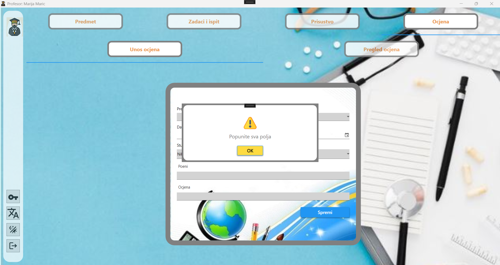

6. **캛uvanje podataka**  
   - Klikom na dugme **"Sa캜uvaj"**, profesor memori코e unesene vrijednosti.  
   - Nakon uspje코nog 캜uvanja, forma se automatski prazni, omogu캖avaju캖i novi unos podataka.

  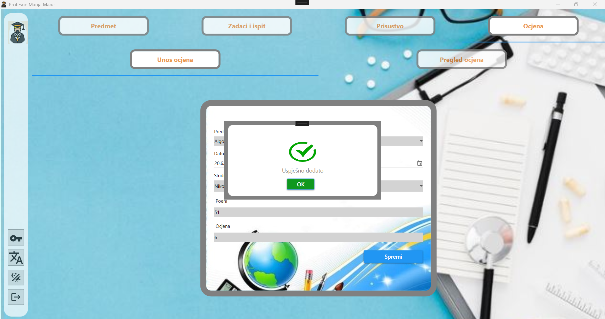

Ova funkcionalnost omogu캖ava profesorima da na jednostavan na캜in evidentiraju ocjene studenata i osiguravaju ta캜nost unesenih podataka.

#### Pregled ocjena

**Opis funkcionalnosti:**

Pregled ocjena omogu캖ava profesoru da na jednostavan na캜in pristupi ocjenama svojih studenata. Funkcionalnost se sastoji od slede캖ih elemenata:

1. **Selekcija studenta**:
   - Profesor mo쬰 odabrati studenta sa liste pomo캖u **lijevog combo-box-a**. Lista studenata prikazuje sve studente koji su povezani sa predmetima koje profesor predaje.

2. **Selekcija predmeta**:
   - Nakon 코to odabere studenta, profesor koristi **desni combo-box** za selektovanje predmeta na kojem predaje. Lista predmeta sadr쬴 samo one predmete na kojima je profesor upisan kao nastavnik.

3. **Prikaz ocjena**:
   - U tabeli ispod combo-box-ova, bi캖e prikazani slede캖i podaci za odabranog studenta:
     - **Ime i prezime studenta**
     - **Ocjena** koju je student postigao na predmetu
     - **Datum ispita** kada je ocjena uneta

**Korisni캜ki interfejs**:

- **Lijevi combo-box**: Sadr쬴 listu studenata.
- **Desni combo-box**: Sadr쬴 listu predmeta koje profesor predaje.
- **Tabela**: Prikazuje ime i prezime studenta, ocjenu i datum ispita.

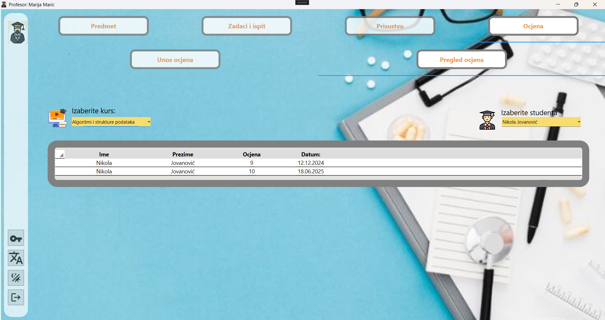

**Napomena**: Ova funkcionalnost omogu캖ava profesorima da brzo i efikasno pregledaju ocjene svojih studenata za specifi캜ne predmete. Sve promjene u selektovanim studentima i predmetima odmah se odra쬬vaju u tabeli, pru쬬ju캖i tako interaktivan i pregledan na캜in za pra캖enje ocjena.

### OpcijaLogout

Na samom dnu MenuBar-a je ikonica za **LogOut**. Kada korisnik dvoklikne na tu ikonicu odjavi캖e se se.

## Funkcionalnosti studenta

### Pregled prisustva, doma캖ih zadataka i ispita

Student ima mogu캖nost pregleda informacija o prisustvu, doma캖im zadacima i ispitima na predmetima za koje je zadu쬰n. Ove informacije su organizovane u tri taba radi bolje preglednosti i funkcionalnosti.

####  Pregled Prisustva
U tabu **Pregled Prisustva**, student mo쬰 pregledati evidenciju svojih prisustava na predavanjima:
- U padaju캖em meniju (**Lista predmeta**) student bira predmet za koji 쬰li da pregleda evidenciju prisustva.
- Nakon odabira predmeta, u tabeli 캖e se prikazati:
  - **Datumi predavanja**.
  - **Informacija** o tome da li je student prisustvovao tim predavanjima.

  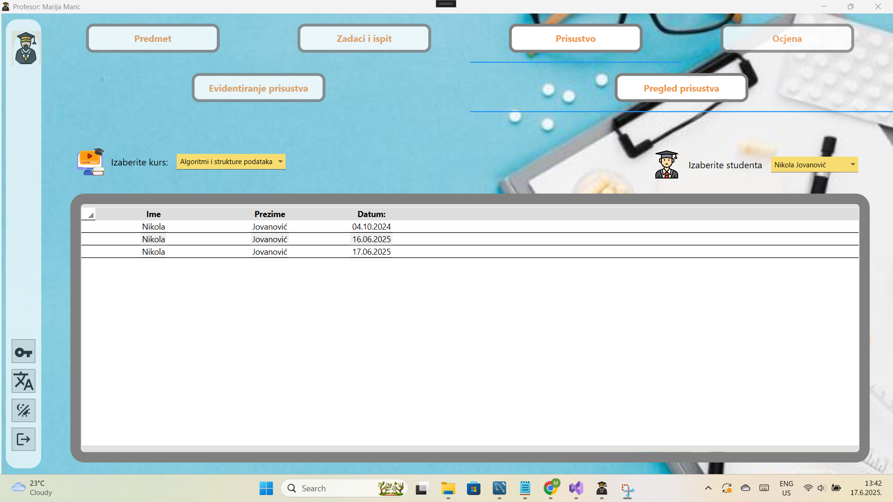

####  Doma캖i zadaci
- Ovaj tab omogu캖ava studentu da pregleda zadatke koji su mu dodijeljeni.  U padaju캖em meniju, student mo쬰 da izabere predmet za koje ho캖e da pregleda doma캖e zadatke.
- Prikazuju se:
  - Naziv zadatka (kolona Ime)
  - Rokovi za predaju (kolona Rok)
  - Opis(kolona Opis).

  

- Klikom na zadatak student mo쬰 da vidi detaljnije informacije o zadatku.

  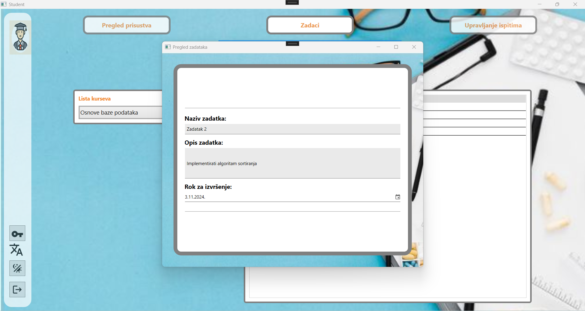

####  Ispiti
- U tabu **Ispiti**, student ima uvid u informacije o organizovanim ispitima na izabranim predmetima.
 Student prvo selektuje predmet za koji 쬰li da vidi ocjene i bodove. U padaju캖em meniju (ComBox) prikazuju se samo predmeti koje slu코a.
  Ukoliko nema evidentiranih informacija u vezi ispita, student 캖e dobiti povratnu informaciju.
- Student mo쬰 pregledati:
  1. **Datum ispita**.
  2. **Broj osvojenih bodova**.
  3. **Krajnju ocjenu** iz predmeta.

  

### Opcija  Logout

Na samom dnu MenuBar-a je ikonica za **LogOut**. Kada korisnik dvoklikne na tu ikonicu odjavi캖e se se ili pre캜icom CTR+L.

U cijeloj aplikaiciji ukoliko je lista prazna, ukoliko je unos nepotpun, neta캜an, ukoliko unijeta vrijednost ne odgovara pretpostavljenoj vrijednosti korisnik 캖e biti obavije코ten porukama u formi iska캜u캖ih prozora.

